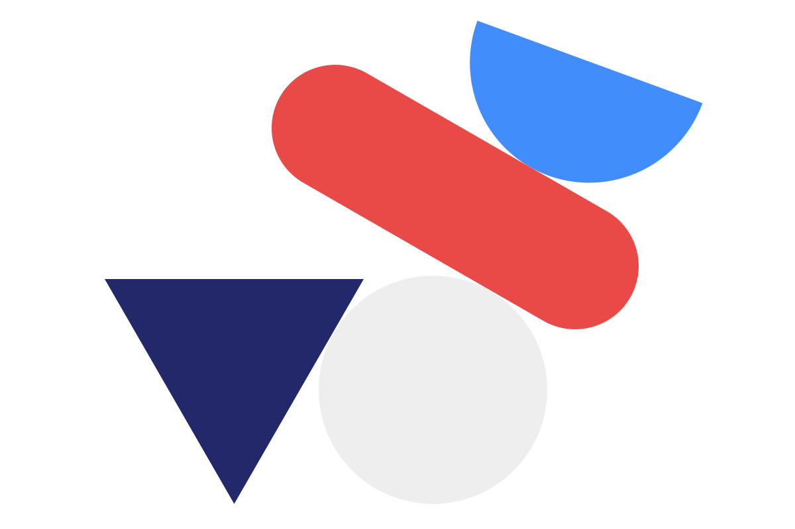

<div align="center">
    
    <h1>Slack Types</h1>
    <p>
        <b>Types for <a href="https://github.com/slack-deno">slack-deno</a> packages. Deno port of <a href="https://www.npmjs.com/package/@slack/types">@slack/types</a></b>
    </p>
    <p>
        
        
        
        
        
        
    </p>
    <p>
        <b><a href="https://deno.land/x/slack_types">View on deno.land</a></b>
    </p>
    <br>
    <br>
    <br>
</div>

## Usage

```ts
import {
    Button, 
    Block,
    // ...
} from 'https://deno.land/x/slack_types@3.0.1/mod.ts
```

## Supporters

[](https://github.com/slack-deno/types/stargazers)

[](https://github.com/slack-deno/types/network/members)

## Related

- [Deno modules](https://github.com/KhushrajRathod/DenoModules)
